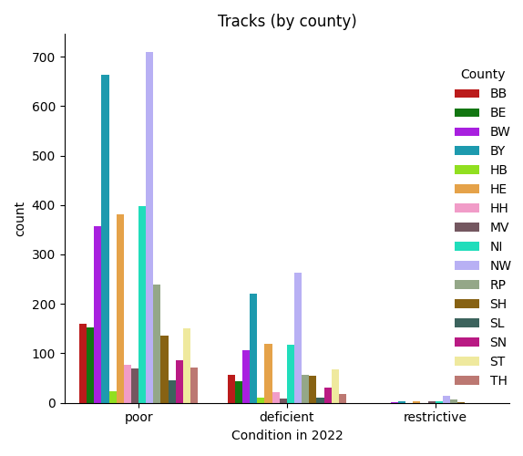

# dbakel-vis

This repository is an attempt at visualising the 'debacle' that is the
German railway system at the moment. Based on a [recent report by the
German Government](https://dserver.bundestag.de/btd/20/102/2010284.pdf)
as an answer to the conservative opposition party, a list of the status
of several objects of the German railway system was provided.

The report is quite long (and preserved in the `raw` folder) and
contains a lot of tables, making the parsing process quite hard. I wrote
some code to extract said tables and visualise them---please find the
results below.

## Remarks

- Notice that these visualisations only show a fraction of all objects,
  namely the ones that are not in the best condition any more. It is
  unclear what the total count should be. **If you know where to find an
  assessment that contains all conditions, let me know.**

- I am unsure about the grading scale and followed the ordering in the
  original report. It seems that 'restrictive' is the lowest grade,
  indicating that maintenance of this part of the infrastructure will
  pose a restriction for additional parts of the network.

# Figures

It's not looking good for Deutsche Bahn, in particular in North
Rhine-Westphalia (NW) and Bavaria (BY). There's a lot of things
to do now...

## Bridges (Brücken)

## Crossings (Übergänge)

## Structures (Stützbauwerke)

## Switches (Weichen)

## Tracks (Gleise)

# Files

# Scripts

- `extract.py`: run this to (re-)create the tables. All tables will be
  placed in the `tables` directory.

- `visualise.py`: create some visualisations. This is where you can get
  creative! To create some visualisations for a specific object, just
  call the script with the respective parameter. For instance, to
  visualise the condition of bridges, call `python visualise.py
  tables/Bridges.csv`. This will create the respective figures in the
  `figures` directory.

# License

The code is licensed under a BSD 3-Clause License. This basically means
you are allowed to do everything you want with it as long as you retain
the license and copyright notice. Of course, there are no warranties or
liabilities, so use it at your own risk.
